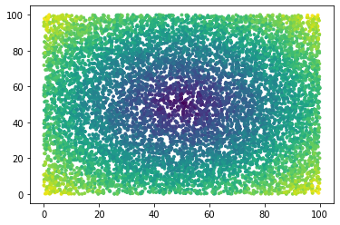

vgrid
=====

Vgrid is a python class for incremental gridding. Grid parameters are
established to include the grid node spacing, radius of influence of
each grid node and type of grid (mean, median, etc.). Then x,y,z data
can be added to the grid incrementally. Vgrid will calculate the griding
function for all points falling within the radius of influence of each
grid node. The grid grows dynamically to accommodate the extent of the
input data. New data can be added with subsequent “adds”. Here’s an
example:

.. code:: ipython3

    import vgrid
    import matplotlib.pyplot as plt
    from mpl_toolkits import mplot3d
    import numpy as np

First we’ll create some test data.

.. code:: ipython3

    x = np.random.random((10000,1)) * 100
    y = np.random.random((10000,1)) * 100
    z = np.sqrt((x-50)**2 + (y-50)**2) + np.random.random(x.shape) * 10
    plt.scatter(x,y,c=z, s=8)

.. parsed-literal::

    <matplotlib.collections.PathCollection at 0x7f8bc10b7ba8>

Now create a mean grid, with grid interval of 5 and a radius of
influence of 10. In this example, points are selected randomly in
batches of 100 to illustrate the incremental gridding capability. As
more points are added a more complete and less noisy grid is created.
Note that the grid values, and their standard deviation are accessed
through function calls, ``G.zz()`` and ``G.std()`` rather than a class
member variables.

.. code:: ipython3

    G = vgrid.vgrid(5,10,type='mean')
    for q in range(10):
        ii = np.random.randint(0,10000,size=100)
        G.add(x[ii],y[ii],z[ii],1)
        xxx,yyy = np.meshgrid(G.xx,G.yy)
        plt.figure(figsize=(10,5))
        plt.subplot(121)
        plt.pcolor(xxx,yyy,G.zz())
        plt.title("Grid -- " + str((q+1)*200) + ' points')
        plt.subplot(122)
        plt.pcolor(xxx,yyy,G.std())
        if q == 0:
            cmax = np.nanmax(G.std().ravel())
        plt.clim(0,cmax)
        plt.title("STDDEV -- " + str((q+1)*200) + ' points')
        plt.show()

``vgrid`` is a work in progress. It is being ported from a MATLAB
routine where it runs faster by at least a factor of two. Scipy KDTrees
were experimented with but turned out to be slower by a factor of 10.
Research is ongoing to speed things up.

Not all gridding methods found under ``G.add()`` have been ported yet.

